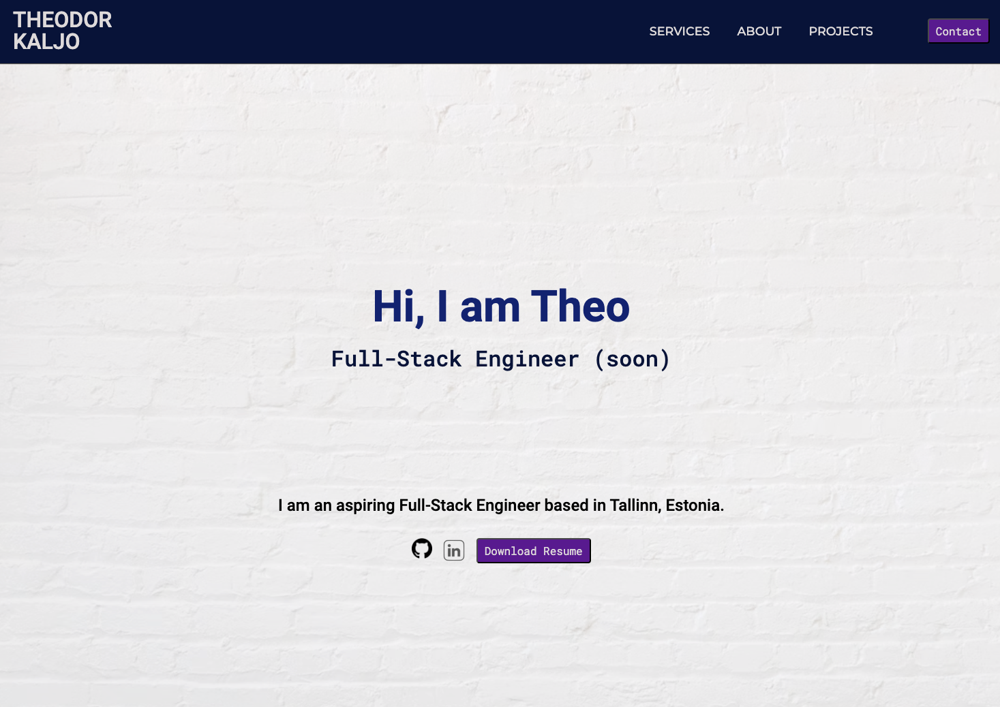
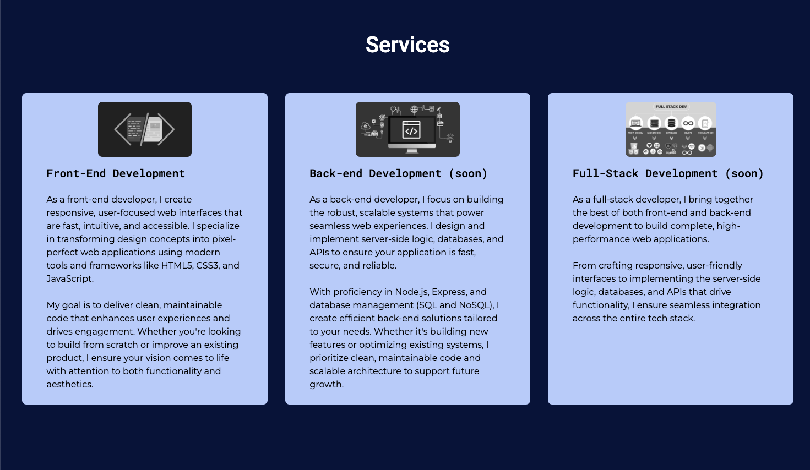
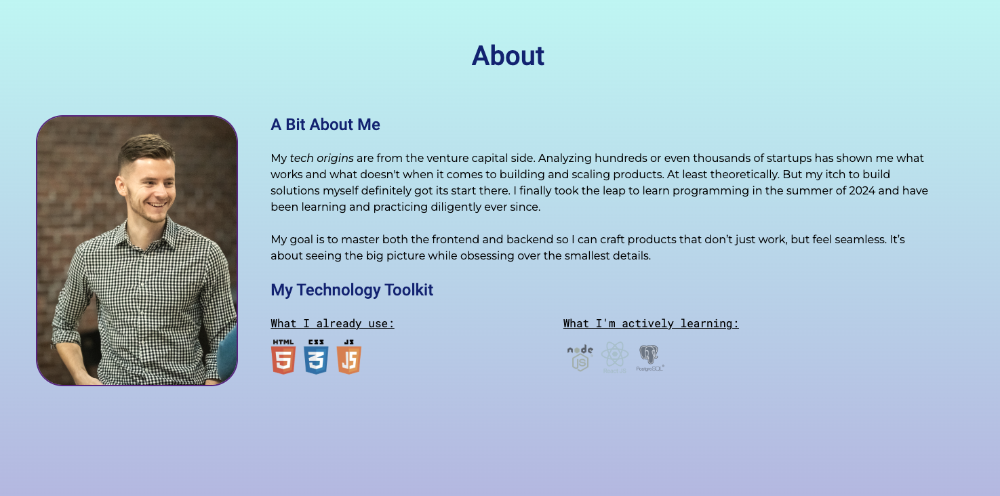
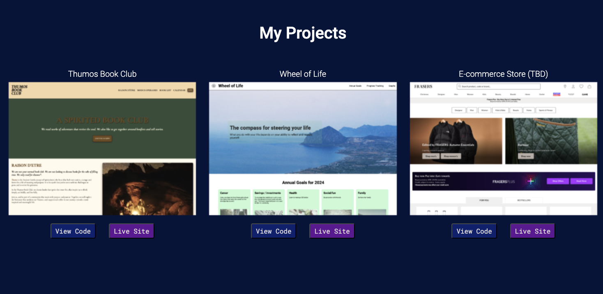
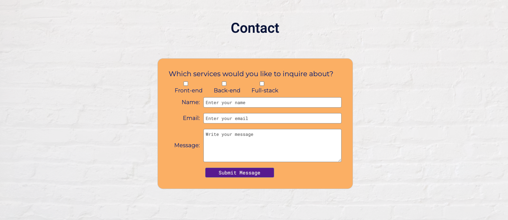

# Personal Developer Portfolio Website 

## Summary of the project

This is my personal portfolio which showcases my programming skills and experience. Link to view live site: https://theografiska.github.io/portfoliowebsite/.

### Technologies used:
- HTML
- CSS
- Javascript
- Markdown
- Git (operating through Terminal)
- GitHub (pushing code from Terminal)

### Screenshots of the website

